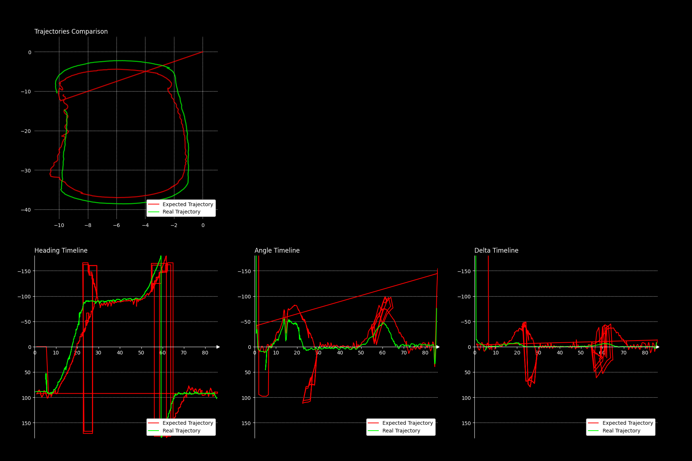

# Compare Trajectories
This script creates a series of charts that show the differences between two trajectories.

# Run on your machine

1. Clone the repository
```
git clone git@github.com:DonatelloDonini/compare_trajectories.git
cd compare_trajectories/
```

2. Create a virtual environment
```
python -m venv venv
```

3. Install dependencies
```
pip install matplotlib pandas
```

# Output examples
